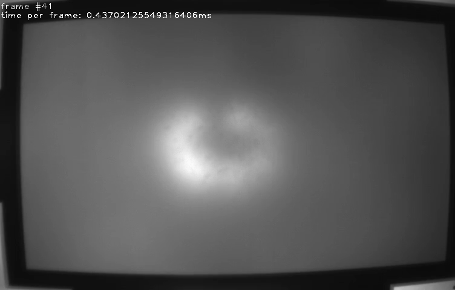
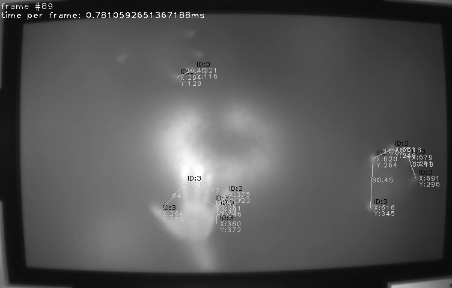
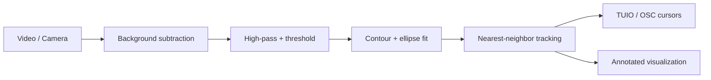

# TUIO Touch Tracker

> Real-time multitouch blob tracking that turns a camera feed into **TUIO cursor events** for any TUIO-compatible application.




## What it is

TUIO Touch Tracker detects fingertips/blobs in a video or camera stream using a
classic computer-vision pipeline, tracks them across frames with stable IDs, and
broadcasts them as **TUIO 1.1 cursors over OSC**. That makes it a drop-in touch
source for any TUIO client — interactive tables, Processing / openFrameworks /
Pure Data sketches, reacTIVision-style setups, and multitouch frameworks.

## Why TUIO?

[TUIO](https://www.tuio.org/) is the de-facto open protocol for tangible and
multitouch surfaces. By speaking TUIO, this project plugs straight into a large
ecosystem of existing clients — no custom integration required. Point your TUIO
client at `127.0.0.1:3333` and it receives live cursor down/move/up events.

## How it works





1. **Background subtraction** — each frame is differenced against a reference frame.
2. **High-pass + threshold** — a blurred copy is subtracted to sharpen blobs, then binarized.
3. **Blob detection** — contours are found and ellipses fit to candidate touches.
4. **Tracking** — each touch is matched to the nearest touch in the previous frame to keep a stable ID.
5. **TUIO output** — new/moved/lifted touches become TUIO cursor events.

## Quickstart

```bash
git clone <your-repo-url>
cd TUIO-Touch-Tracker
pip install -e .

# run on the bundled sample video
tuio-touch-tracker
```

A window opens showing tracked touches; TUIO cursors stream to `127.0.0.1:3333`.

## Configuration

| Flag | Default | Description |
|------|---------|-------------|
| `--video` | `data/mt_camera_raw.mp4` | Input video path |
| `--threshold` | `10` | Binarization threshold |
| `--min-area` | `30` | Minimum blob area (px²) |
| `--tuio-host` | `127.0.0.1` | TUIO/OSC host |
| `--tuio-port` | `3333` | TUIO/OSC port |
| `--max-frames` | `None` | Stop after N frames |
| `--save-frames DIR` | — | Save annotated frames to DIR |
| `--no-display` | — | Run headless (no GUI windows) |

Headless example (servers/CI, demo media):

```bash
tuio-touch-tracker --no-display --save-frames out/ --max-frames 120
```

## Project structure

```
src/tuio_touch_tracker/
├── detection.py      # background subtraction -> contours -> ellipses
├── tracking.py       # nearest-neighbor ID assignment
├── tuio_sender.py    # TUIO/OSC cursor events
├── visualization.py  # annotated frame rendering
├── pipeline.py       # main loop
├── cli.py            # command-line interface
└── touch.py          # Touch data model
```

## Roadmap / Known limitations

This release preserves the original prototype's behavior. Planned improvements:

- Fix `finger_up` so lifted cursors are removed by id (currently a no-op).
- Stream cursors continuously instead of clearing every frame / starting at frame 49.
- Live camera capture flag and on-screen calibration of threshold/area.
- Unit-test the full pipeline against recorded fixtures.

## License

MIT © Ritvik Maini — see [LICENSE](LICENSE).
