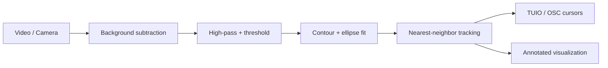

# TUIO Touch Tracker — Publishing Polish Implementation Plan

> **For agentic workers:** REQUIRED SUB-SKILL: Use superpowers:subagent-driven-development (recommended) or superpowers:executing-plans to implement this plan task-by-task. Steps use checkbox (`- [ ]`) syntax for tracking.

**Goal:** Refactor the two-file prototype into a clean, installable `tuio_touch_tracker` package with a headless mode, generate demo media, and add a visually impressive TUIO-focused README plus supporting files — preserving the existing algorithm's behavior exactly.

**Architecture:** Move the monolithic `blob.py` loop into focused modules (detection, tracking, tuio_sender, visualization, pipeline) under a `src/`-layout package, driven by an argparse CLI. Pure-logic modules get unit tests; cv2/network modules get a headless smoke run. The original algorithm and defaults are preserved verbatim.

**Tech Stack:** Python 3.11, OpenCV (`opencv-python`), NumPy, `python-tuio`, pytest, argparse, setuptools/pyproject.

---

## Task 0: Test tooling + package skeleton

**Files:**
- Create: `src/tuio_touch_tracker/__init__.py`
- Create: `tests/__init__.py`
- Modify: `.venv` (install pytest)

- [ ] **Step 1: Install pytest into the existing venv**

Run: `.venv/bin/pip install pytest`
Expected: pytest installs successfully.

- [ ] **Step 2: Create the package + tests directories**

Create `src/tuio_touch_tracker/__init__.py`:

```python
"""TUIO Touch Tracker — multitouch blob tracking that streams TUIO cursor events."""

__version__ = "0.1.0"
```

Create empty `tests/__init__.py` (empty file).

- [ ] **Step 3: Verify pytest runs (no tests yet)**

Run: `.venv/bin/python -m pytest -q`
Expected: "no tests ran" exit 5 (acceptable) — confirms pytest is wired.

- [ ] **Step 4: Commit**

```bash
git add src/tuio_touch_tracker/__init__.py tests/__init__.py
git commit -m "chore: add package skeleton and pytest"
```

---

## Task 1: Move the Touch model into the package + test it

**Files:**
- Create: `src/tuio_touch_tracker/touch.py` (content from existing `touch.py`, unchanged)
- Create: `tests/test_touch.py`
- Delete: `touch.py` (root), after move

- [ ] **Step 1: Write failing tests for Touch**

Create `tests/test_touch.py`:

```python
import math
from tuio_touch_tracker.touch import Touch, delete_duplicates


def test_distance_is_euclidean():
    a = Touch(0, 0, 1)
    b = Touch(3, 4, 1)
    assert a.calc_distance(b) == 5.0


def test_nearest_skips_self_and_returns_closest():
    a = Touch(0, 0, 1); a.set_id(1)
    near = Touch(1, 1, 1); near.set_id(2)
    far = Touch(10, 10, 1); far.set_id(3)
    assert a.nearest([a, near, far]).get_id() == 2


def test_nearest_on_empty_returns_placeholder_id_zero():
    a = Touch(0, 0, 1); a.set_id(1)
    assert a.nearest([a]).get_id() == 0


def test_equality_and_hash_by_id():
    a = Touch(0, 0, 1); a.set_id(5)
    b = Touch(9, 9, 2); b.set_id(5)
    assert a == b
    assert hash(a) == hash(b)


def test_delete_duplicates_keeps_first_per_id():
    a = Touch(0, 0, 1); a.set_id(1)
    b = Touch(1, 1, 1); b.set_id(1)
    c = Touch(2, 2, 1); c.set_id(2)
    result = delete_duplicates([a, b, c])
    assert [t.get_id() for t in result] == [1, 2]
```

- [ ] **Step 2: Run to verify it fails**

Run: `.venv/bin/python -m pytest tests/test_touch.py -q`
Expected: FAIL — `ModuleNotFoundError: No module named 'tuio_touch_tracker.touch'`.

- [ ] **Step 3: Create the module by moving the existing file**

Run: `git mv touch.py src/tuio_touch_tracker/touch.py`
(The file content is unchanged — `Touch` class + `delete_duplicates`.)

- [ ] **Step 4: Make the package importable for the test run**

Create `pyproject.toml` at repo root (minimal, enough for editable install):

```toml
[build-system]
requires = ["setuptools>=68"]
build-backend = "setuptools.build_meta"

[project]
name = "tuio-touch-tracker"
version = "0.1.0"
description = "Real-time multitouch blob tracking that streams TUIO cursor events."
readme = "README.md"
requires-python = ">=3.9"
license = { text = "MIT" }
authors = [{ name = "Ritvik Maini", email = "mainiritvik@gmail.com" }]
dependencies = [
    "opencv-python>=4.5",
    "numpy>=1.21",
    "python-tuio>=0.0.9",
]

[project.scripts]
tuio-touch-tracker = "tuio_touch_tracker.cli:main"

[tool.setuptools.packages.find]
where = ["src"]
```

Run: `.venv/bin/pip install -e .`
Expected: installs `tuio-touch-tracker` in editable mode.

- [ ] **Step 5: Run tests to verify they pass**

Run: `.venv/bin/python -m pytest tests/test_touch.py -q`
Expected: 5 passed.

- [ ] **Step 6: Commit**

```bash
git add src/tuio_touch_tracker/touch.py tests/test_touch.py pyproject.toml
git commit -m "refactor: move Touch model into package with tests"
```

---

## Task 2: Tracking module + tests

**Files:**
- Create: `src/tuio_touch_tracker/tracking.py`
- Create: `tests/test_tracking.py`

- [ ] **Step 1: Write failing tests**

Create `tests/test_tracking.py`:

```python
from tuio_touch_tracker.touch import Touch
from tuio_touch_tracker.tracking import assign_ids, existence


def make(x, y, tid=0):
    t = Touch(x, y, 1)
    t.set_id(tid)
    return t


def test_new_touch_with_no_previous_gets_new_id():
    current = [Touch(5, 5, 1)]
    assigned, counter = assign_ids(current, previous=[], id_counter=0)
    assert assigned[0].get_id() == 1
    assert counter == 1


def test_touch_near_previous_reuses_its_id():
    previous = [make(5, 5, tid=7)]
    current = [Touch(6, 6, 2)]
    assigned, counter = assign_ids(current, previous, id_counter=7)
    assert assigned[0].get_id() == 7
    assert counter == 7  # no new id allocated


def test_existence_true_when_id_present():
    assert existence(make(0, 0, tid=3), [make(9, 9, tid=3)]) is True
    assert existence(make(0, 0, tid=3), [make(9, 9, tid=4)]) is False
```

- [ ] **Step 2: Run to verify it fails**

Run: `.venv/bin/python -m pytest tests/test_tracking.py -q`
Expected: FAIL — `ModuleNotFoundError: No module named 'tuio_touch_tracker.tracking'`.

- [ ] **Step 3: Implement tracking.py**

Create `src/tuio_touch_tracker/tracking.py` (logic lifted verbatim from blob.py 126–131, 70–75):

```python
"""Nearest-neighbor touch ID assignment across frames."""

from .touch import Touch


def assign_ids(current, previous, id_counter):
    """Assign each current touch an id by nearest match in previous frame.

    Reuses the nearest previous touch's id when one exists (id > 0),
    otherwise allocates a fresh id. Returns (current, id_counter).
    Behavior preserved from the original blob.py loop.
    """
    for touch in current:
        nearest_touch = touch.nearest(previous)
        if nearest_touch.get_id() > 0:
            touch.set_id(nearest_touch.get_id())
        else:
            id_counter += 1
            touch.set_id(id_counter)
    return current, id_counter


def existence(obj, previous):
    """True if a touch with obj's id exists in previous."""
    for touch in previous:
        if obj.get_id() == touch.get_id():
            return True
    return False
```

- [ ] **Step 4: Run tests to verify they pass**

Run: `.venv/bin/python -m pytest tests/test_tracking.py -q`
Expected: 3 passed.

- [ ] **Step 5: Commit**

```bash
git add src/tuio_touch_tracker/tracking.py tests/test_tracking.py
git commit -m "refactor: extract tracking module with tests"
```

---

## Task 3: TUIO sender module + normalize test

**Files:**
- Create: `src/tuio_touch_tracker/tuio_sender.py`
- Create: `tests/test_tuio_sender.py`

- [ ] **Step 1: Write failing test for normalize**

Create `tests/test_tuio_sender.py`:

```python
from tuio_touch_tracker.tuio_sender import normalize


def test_normalize_divides_by_dimensions():
    assert normalize(50, 25, width=100, height=50) == (0.5, 0.5)


def test_normalize_origin():
    assert normalize(0, 0, width=640, height=480) == (0.0, 0.0)
```

- [ ] **Step 2: Run to verify it fails**

Run: `.venv/bin/python -m pytest tests/test_tuio_sender.py -q`
Expected: FAIL — `ModuleNotFoundError: No module named 'tuio_touch_tracker.tuio_sender'`.

- [ ] **Step 3: Implement tuio_sender.py**

Create `src/tuio_touch_tracker/tuio_sender.py` (logic from blob.py 7–25, 76–80; `width`/`height` now passed in instead of globals — behavior identical):

```python
"""TUIO cursor event sending. Wraps pythontuio's TuioServer.

Behavior preserved verbatim from the original blob.py, including the
known quirks documented in the README (e.g. finger_up removing an int
from a list of Cursor objects).
"""

from pythontuio import TuioServer, Cursor


def normalize(x, y, width, height):
    return (x / width), (y / height)


def finger_down(cursor_id, x, y, server, width, height):
    nx, ny = normalize(x, y, width, height)
    cursor = Cursor(cursor_id)
    cursor.position = (nx, ny)
    server.cursors.append(cursor)
    return server


def finger_moved(cursor_id, x, y, server, width, height):
    nx, ny = normalize(x, y, width, height)
    cursor = next((c for c in server.cursors if c.session_id == cursor_id), None)
    if cursor:
        cursor.position = (nx, ny)
    return server


def finger_up(cursor_id, server):
    # Preserved as-is from the original (see README known limitations).
    if cursor_id in server.cursors:
        server.cursors.remove(cursor_id)
        print(f"REMOVE: Cursor ID: {cursor_id}")
    return server


def print_touch_events(current, server):
    for cursor in server.cursors:
        for touch in current:
            if cursor.session_id == touch.get_id():
                print(f"Cursor ID: {touch.get_id()} X: {touch.get_x()} Y: {touch.get_y()}")


def new_server():
    return TuioServer()
```

- [ ] **Step 4: Run tests to verify they pass**

Run: `.venv/bin/python -m pytest tests/test_tuio_sender.py -q`
Expected: 2 passed.

- [ ] **Step 5: Commit**

```bash
git add src/tuio_touch_tracker/tuio_sender.py tests/test_tuio_sender.py
git commit -m "refactor: extract tuio_sender module with normalize test"
```

---

## Task 4: Detection module

**Files:**
- Create: `src/tuio_touch_tracker/detection.py`
- Create: `tests/test_detection.py`

- [ ] **Step 1: Write a failing test using a synthetic frame**

Create `tests/test_detection.py`:

```python
import numpy as np
from tuio_touch_tracker.detection import Detector


def test_detector_finds_a_blob_against_blank_reference():
    # Reference: all black. Frame: a bright filled disk -> one blob.
    h, w = 120, 160
    reference = np.zeros((h, w), dtype=np.uint8)
    frame = np.zeros((h, w), dtype=np.uint8)
    import cv2
    cv2.circle(frame, (80, 60), 18, 255, -1)

    det = Detector(reference)
    touches = det.detect(frame, frame_no=1)

    assert len(touches) >= 1
    # Blob center should be near the drawn circle center.
    t = touches[0]
    assert abs(t.get_x() - 80) < 15
    assert abs(t.get_y() - 60) < 15
```

- [ ] **Step 2: Run to verify it fails**

Run: `.venv/bin/python -m pytest tests/test_detection.py -q`
Expected: FAIL — `ModuleNotFoundError: No module named 'tuio_touch_tracker.detection'`.

- [ ] **Step 3: Implement detection.py**

Create `src/tuio_touch_tracker/detection.py` (logic from blob.py 62–69, 117–132; thresholds parameterized with original defaults):

```python
"""Blob detection: background subtraction -> contours -> ellipse centers."""

import cv2

from .touch import Touch


class Detector:
    """Detects touch blobs in a grayscale frame against a reference frame."""

    def __init__(self, reference, threshold=10, min_area=30, blur_ksize=20):
        self.reference = reference
        self.threshold = threshold
        self.min_area = min_area
        self.blur_ksize = blur_ksize

    def binarize(self, frame):
        dframe = cv2.absdiff(frame, self.reference)
        blurred = cv2.blur(dframe, (self.blur_ksize, self.blur_ksize))
        highpass = cv2.absdiff(dframe, blurred)
        _, binarized = cv2.threshold(highpass, self.threshold, 255, cv2.THRESH_BINARY)
        return binarized

    def detect(self, frame, frame_no):
        binarized = self.binarize(frame)
        contours, hierarchy = cv2.findContours(
            binarized, cv2.RETR_CCOMP, cv2.CHAIN_APPROX_SIMPLE
        )
        touches = []
        if hierarchy is not None and len(hierarchy) > 0:
            hierarchy = hierarchy[0]
            for idx in range(len(hierarchy)):
                if cv2.contourArea(contours[idx]) > self.min_area and len(contours[idx]) > 4:
                    ellipse = cv2.fitEllipse(contours[idx])
                    cx, cy = ellipse[0][0], ellipse[0][1]
                    touches.append(Touch(cx, cy, frame_no))
        return touches
```

- [ ] **Step 4: Run tests to verify they pass**

Run: `.venv/bin/python -m pytest tests/test_detection.py -q`
Expected: 1 passed.

- [ ] **Step 5: Commit**

```bash
git add src/tuio_touch_tracker/detection.py tests/test_detection.py
git commit -m "refactor: extract detection module with synthetic-blob test"
```

---

## Task 5: Visualization module

**Files:**
- Create: `src/tuio_touch_tracker/visualization.py`
- Create: `tests/test_visualization.py`

- [ ] **Step 1: Write a failing test that annotate returns a frame of same shape**

Create `tests/test_visualization.py`:

```python
import numpy as np
from tuio_touch_tracker.touch import Touch
from tuio_touch_tracker.visualization import annotate


def test_annotate_returns_same_shape_and_does_not_crash():
    frame = np.zeros((120, 160, 3), dtype=np.uint8)
    t1 = Touch(40, 40, 1); t1.set_id(1)
    t2 = Touch(80, 80, 1); t2.set_id(2)
    out = annotate(frame, [t1, t2], frame_no=5, ms_time=0.01)
    assert out.shape == frame.shape
```

- [ ] **Step 2: Run to verify it fails**

Run: `.venv/bin/python -m pytest tests/test_visualization.py -q`
Expected: FAIL — `ModuleNotFoundError: No module named 'tuio_touch_tracker.visualization'`.

- [ ] **Step 3: Implement visualization.py**

Create `src/tuio_touch_tracker/visualization.py` (drawing logic from blob.py 26–61, minus the imshow which moves to the pipeline; returns the annotated frame):

```python
"""Frame annotation: draw touch ids, coordinates, and nearest-neighbor links."""

import cv2


def annotate(frame, touches, frame_no, ms_time):
    """Draw ids/coordinates and nearest-neighbor lines. Returns the frame."""
    for touch in touches:
        base_x = int(touch.get_x()) + 5
        base_y = int(touch.get_y()) - 5

        cv2.putText(frame, "ID:" + str(touch.get_id()), (base_x, base_y),
                    cv2.FONT_HERSHEY_PLAIN, 0.8, (0, 0, 0), 1, 8)
        cv2.putText(frame, "X:" + str(int(touch.get_x())), (base_x, base_y + 10),
                    cv2.FONT_HERSHEY_PLAIN, 0.8, (200, 80, 80), 1, 8)
        cv2.putText(frame, "Y:" + str(int(touch.get_y())), (base_x, base_y + 20),
                    cv2.FONT_HERSHEY_PLAIN, 0.8, (200, 80, 80), 1, 8)

        nearest_touch = touch.nearest(touches)
        if nearest_touch.get_id() > 0:
            cv2.line(frame, (int(touch.get_x()), int(touch.get_y())),
                     (int(nearest_touch.get_x()), int(nearest_touch.get_y())),
                     (200, 200, 200), 1)
            distance = touch.calc_distance(nearest_touch)
            midpoint = ((int(touch.get_x()) + int(nearest_touch.get_x())) // 2,
                        (int(touch.get_y()) + int(nearest_touch.get_y())) // 2)
            cv2.putText(frame, "{:.2f}".format(distance), midpoint,
                        cv2.FONT_HERSHEY_PLAIN, 0.8, (200, 200, 200), 1, 8)

    cv2.putText(frame, "frame #" + str(frame_no), (0, 15),
                cv2.FONT_HERSHEY_PLAIN, 1, (255, 255, 255), 1, 4)
    cv2.putText(frame, "time per frame: " + str(ms_time * 1000) + "ms", (0, 30),
                cv2.FONT_HERSHEY_PLAIN, 1, (255, 255, 255), 1, 1)
    return frame
```

- [ ] **Step 4: Run tests to verify they pass**

Run: `.venv/bin/python -m pytest tests/test_visualization.py -q`
Expected: 1 passed.

- [ ] **Step 5: Commit**

```bash
git add src/tuio_touch_tracker/visualization.py tests/test_visualization.py
git commit -m "refactor: extract visualization module with shape test"
```

---

## Task 6: Pipeline orchestration

**Files:**
- Create: `src/tuio_touch_tracker/pipeline.py`

- [ ] **Step 1: Implement pipeline.py**

Create `src/tuio_touch_tracker/pipeline.py`. This wires capture → detect → assign_ids → TUIO diff → annotate, preserving the original loop's order and quirks (blob.py 82–183). Display and frame-saving are decoupled so it can run headless.

```python
"""Main processing loop: video -> detection -> tracking -> TUIO -> render."""

import os
import time

import cv2

from .detection import Detector
from .tracking import assign_ids
from .tuio_sender import (
    finger_down, finger_moved, finger_up, print_touch_events, new_server,
)
from .visualization import annotate


def run(video_path, *, threshold=10, min_area=30, tuio_host="127.0.0.1",
        tuio_port=3333, display=True, save_frames=None, max_frames=None):
    cap = cv2.VideoCapture(video_path)
    if not cap.isOpened():
        raise RuntimeError(f"Could not open video: {video_path}")

    width = cap.get(cv2.CAP_PROP_FRAME_WIDTH)
    height = cap.get(cv2.CAP_PROP_FRAME_HEIGHT)

    server = new_server()
    previous = []
    id_counter = 0
    current_frame = 0

    if save_frames:
        os.makedirs(save_frames, exist_ok=True)

    ret, frame = cap.read()
    if not ret:
        print("TERMINATION: Camerastream stopped or last frame of video reached.")
        cap.release()
        return id_counter
    reference = cv2.cvtColor(frame, cv2.COLOR_BGR2GRAY)
    detector = Detector(reference, threshold=threshold, min_area=min_area)

    condition = True
    while condition:
        ret, frame = cap.read()
        ms_start = time.time()
        current_frame += 1
        if not ret:
            print("TERMINATION: Camerastream stopped or last frame of video reached.")
            break
        if max_frames is not None and current_frame > max_frames:
            break

        gray = cv2.cvtColor(frame, cv2.COLOR_BGR2GRAY)
        if display:
            cv2.imshow("original video", gray)

        current = detector.detect(gray, current_frame)
        current, id_counter = assign_ids(current, previous, id_counter)

        currentcopy = current.copy()
        items_to_remove = set()
        for t1 in current:
            for t2 in previous:
                if t1.get_id() == t2.get_id():
                    server = finger_moved(t1.get_id(), t1.get_x(), t1.get_y(),
                                          server, width, height)
                    items_to_remove.add(t1)
        for item in items_to_remove:
            if item in currentcopy:
                currentcopy.remove(item)
        for t1 in previous:
            if t1 not in currentcopy:
                server = finger_up(t1.get_id(), server)
        for t1 in current:
            if t1 not in previous:
                server = finger_down(t1.get_id(), t1.get_x(), t1.get_y(),
                                     server, width, height)

        if current_frame > 49:
            server.send_bundle()
            print_touch_events(current, server)
        server.cursors.clear()

        ms_time = time.time() - ms_start
        annotated = annotate(gray, current, current_frame, ms_time)
        if display:
            cv2.imshow("Result Window", annotated)
        if save_frames:
            cv2.imwrite(os.path.join(save_frames, f"frame_{current_frame:05d}.png"),
                        annotated)

        previous = current.copy()
        if display and (cv2.waitKey(30) & 0xFF == ord("q")):
            print("TERMINATION - q")
            break

    print("the number of unique touches: ", id_counter)
    print("SUCCESS: Program terminated like expected.")
    cap.release()
    if display:
        cv2.destroyAllWindows()
    return id_counter
```

- [ ] **Step 2: Smoke-run headless on the sample video**

Run:
```bash
.venv/bin/python -c "from tuio_touch_tracker.pipeline import run; run('mt_camera_raw.mp4', display=False, max_frames=5)"
```
Expected: prints frame/termination logs and "SUCCESS"; no GUI window; no exception.

- [ ] **Step 3: Commit**

```bash
git add src/tuio_touch_tracker/pipeline.py
git commit -m "refactor: add pipeline orchestration with headless support"
```

---

## Task 7: CLI entry point

**Files:**
- Create: `src/tuio_touch_tracker/cli.py`
- Create: `src/tuio_touch_tracker/__main__.py`

- [ ] **Step 1: Implement cli.py**

Create `src/tuio_touch_tracker/cli.py`:

```python
"""Command-line interface for tuio-touch-tracker."""

import argparse

from .pipeline import run


def build_parser():
    p = argparse.ArgumentParser(
        prog="tuio-touch-tracker",
        description="Real-time multitouch blob tracking that streams TUIO cursor events.",
    )
    p.add_argument("--video", default="data/mt_camera_raw.mp4",
                   help="Path to the input video (default: data/mt_camera_raw.mp4)")
    p.add_argument("--threshold", type=int, default=10,
                   help="Binarization threshold (default: 10)")
    p.add_argument("--min-area", type=int, default=30,
                   help="Minimum contour area to count as a touch (default: 30)")
    p.add_argument("--tuio-host", default="127.0.0.1",
                   help="TUIO/OSC host (default: 127.0.0.1)")
    p.add_argument("--tuio-port", type=int, default=3333,
                   help="TUIO/OSC port (default: 3333)")
    p.add_argument("--max-frames", type=int, default=None,
                   help="Stop after N frames (default: run to end)")
    p.add_argument("--save-frames", default=None,
                   help="Directory to write annotated frames to")
    display = p.add_mutually_exclusive_group()
    display.add_argument("--display", dest="display", action="store_true",
                         help="Show OpenCV windows (default)")
    display.add_argument("--no-display", dest="display", action="store_false",
                         help="Run headless, no GUI windows")
    p.set_defaults(display=True)
    return p


def main(argv=None):
    args = build_parser().parse_args(argv)
    return run(
        args.video,
        threshold=args.threshold,
        min_area=args.min_area,
        tuio_host=args.tuio_host,
        tuio_port=args.tuio_port,
        display=args.display,
        save_frames=args.save_frames,
        max_frames=args.max_frames,
    )


if __name__ == "__main__":
    main()
```

Create `src/tuio_touch_tracker/__main__.py`:

```python
from .cli import main

if __name__ == "__main__":
    main()
```

- [ ] **Step 2: Verify the CLI parses and runs headless**

Run: `.venv/bin/tuio-touch-tracker --video mt_camera_raw.mp4 --no-display --max-frames 5`
Expected: runs to "SUCCESS" with no GUI; no exception.

- [ ] **Step 3: Verify --help works**

Run: `.venv/bin/tuio-touch-tracker --help`
Expected: usage text listing all flags.

- [ ] **Step 4: Commit**

```bash
git add src/tuio_touch_tracker/cli.py src/tuio_touch_tracker/__main__.py
git commit -m "feat: add argparse CLI entry point"
```

---

## Task 8: Git hygiene — data, gitignore, remove old blob.py

**Files:**
- Create: `data/mt_camera_raw.mp4` (real file, from root copy)
- Modify: `.gitignore`
- Delete: `blob.py`, root `mt_camera_raw.mp4`, `data/mt_camera_raw.mp4` symlink

- [ ] **Step 1: Replace the symlink with the real video**

Run:
```bash
rm data/mt_camera_raw.mp4
mv mt_camera_raw.mp4 data/mt_camera_raw.mp4
```
Expected: `data/mt_camera_raw.mp4` is now a real ~537 KB file; root has no mp4.

- [ ] **Step 2: Fix .gitignore**

Replace `.gitignore` contents with:

```gitignore
__pycache__/
*.pyc
.idea/
.venv/
.DS_Store
docs/media/frames/
*.egg-info/
```

(Note: `*.mp4` and `data/` ignores removed so the sample video is tracked.)

- [ ] **Step 3: Remove the now-superseded root script**

Run: `git rm blob.py`
Expected: `blob.py` removed (its logic now lives in the package).

- [ ] **Step 4: Verify a clean run still works from the package**

Run: `.venv/bin/tuio-touch-tracker --no-display --max-frames 5`
Expected: uses the default `data/mt_camera_raw.mp4`, runs to "SUCCESS".

- [ ] **Step 5: Commit**

```bash
git add .gitignore data/mt_camera_raw.mp4
git commit -m "chore: track sample video, fix gitignore, remove old blob.py"
```

---

## Task 9: requirements.txt + LICENSE

**Files:**
- Create: `requirements.txt`
- Create: `LICENSE`

- [ ] **Step 1: Create requirements.txt**

```
opencv-python>=4.5
numpy>=1.21
python-tuio>=0.0.9
```

- [ ] **Step 2: Create the MIT LICENSE**

Create `LICENSE` with the standard MIT text, copyright line:
`Copyright (c) 2026 Ritvik Maini`
(Use the canonical MIT License body verbatim.)

- [ ] **Step 3: Commit**

```bash
git add requirements.txt LICENSE
git commit -m "chore: add requirements and MIT license"
```

---

## Task 10: Generate demo media

**Files:**
- Create: `docs/media/screenshot.png`
- Create: `docs/media/demo.gif`

- [ ] **Step 1: Render annotated frames headlessly**

Run:
```bash
.venv/bin/tuio-touch-tracker --no-display --save-frames docs/media/frames --max-frames 120
```
Expected: `docs/media/frames/frame_00001.png` … exist.

- [ ] **Step 2: Pick a representative still as the screenshot**

Choose a frame with several tracked touches visible (e.g. frame ~80) and copy it:
```bash
cp docs/media/frames/frame_00080.png docs/media/screenshot.png
```
Expected: `docs/media/screenshot.png` shows IDs, X/Y, and nearest-neighbor links.

- [ ] **Step 3: Build a GIF from the frames**

Prefer imageio (pure-Python, no system ffmpeg needed). Install and build:
```bash
.venv/bin/pip install imageio
.venv/bin/python - <<'PY'
import glob, imageio.v2 as imageio
files = sorted(glob.glob("docs/media/frames/frame_*.png"))[::3]  # every 3rd frame
frames = [imageio.imread(f) for f in files]
imageio.mimsave("docs/media/demo.gif", frames, fps=12, loop=0)
print("wrote docs/media/demo.gif", len(frames), "frames")
PY
```
Expected: `docs/media/demo.gif` created. If it exceeds ~8 MB, increase the stride (`[::5]`) or reduce frame count and re-run.

- [ ] **Step 4: Commit the media (frames dir stays gitignored)**

```bash
git add docs/media/screenshot.png docs/media/demo.gif
git commit -m "docs: add demo screenshot and gif"
```

---

## Task 11: README

**Files:**
- Create: `README.md`

- [ ] **Step 1: Write README.md**

Create `README.md` with these sections (use real content, not placeholders):

```markdown
# TUIO Touch Tracker

> Real-time multitouch blob tracking that turns a camera feed into **TUIO cursor events** for any TUIO-compatible application.


## What it is

TUIO Touch Tracker detects fingertips/blobs in a video or camera stream using a
classic computer-vision pipeline, tracks them across frames with stable IDs, and
broadcasts them as **TUIO 1.1 cursors over OSC**. That makes it a drop-in touch
source for any TUIO client — interactive tables, Processing / openFrameworks /
Pure Data sketches, reacTIVision-style setups, and multitouch frameworks.

## Why TUIO?

[TUIO](https://www.tuio.org/) is the de-facto open protocol for tangible and
multitouch surfaces. By speaking TUIO, this project plugs straight into a large
ecosystem of existing clients — no custom integration required. Point your TUIO
client at `127.0.0.1:3333` and it receives live cursor down/move/up events.

## How it works




1. **Background subtraction** — each frame is differenced against a reference frame.
2. **High-pass + threshold** — a blurred copy is subtracted to sharpen blobs, then binarized.
3. **Blob detection** — contours are found and ellipses fit to candidate touches.
4. **Tracking** — each touch is matched to the nearest touch in the previous frame to keep a stable ID.
5. **TUIO output** — new/moved/lifted touches become TUIO cursor events.

## Quickstart

```bash
git clone <your-repo-url>
cd TUIO-Touch-Tracker
pip install -e .

# run on the bundled sample video
tuio-touch-tracker
```

A window opens showing tracked touches; TUIO cursors stream to `127.0.0.1:3333`.

## Configuration

| Flag | Default | Description |
|------|---------|-------------|
| `--video` | `data/mt_camera_raw.mp4` | Input video path |
| `--threshold` | `10` | Binarization threshold |
| `--min-area` | `30` | Minimum blob area (px²) |
| `--tuio-host` | `127.0.0.1` | TUIO/OSC host |
| `--tuio-port` | `3333` | TUIO/OSC port |
| `--max-frames` | `None` | Stop after N frames |
| `--save-frames DIR` | — | Save annotated frames to DIR |
| `--no-display` | — | Run headless (no GUI windows) |

Headless example (servers/CI, demo media):

```bash
tuio-touch-tracker --no-display --save-frames out/ --max-frames 120
```

## Project structure

```
src/tuio_touch_tracker/
├── detection.py      # background subtraction -> contours -> ellipses
├── tracking.py       # nearest-neighbor ID assignment
├── tuio_sender.py    # TUIO/OSC cursor events
├── visualization.py  # annotated frame rendering
├── pipeline.py       # main loop
├── cli.py            # command-line interface
└── touch.py          # Touch data model
```

## Roadmap / Known limitations

This release preserves the original prototype's behavior. Planned improvements:

- Fix `finger_up` so lifted cursors are removed by id (currently a no-op).
- Stream cursors continuously instead of clearing every frame / starting at frame 49.
- Live camera capture flag and on-screen calibration of threshold/area.
- Unit-test the full pipeline against recorded fixtures.

## License

MIT © Ritvik Maini — see [LICENSE](LICENSE).
```

- [ ] **Step 2: Verify the README references real files**

Run: `ls docs/media/demo.gif docs/media/screenshot.png LICENSE`
Expected: all three exist (links resolve on GitHub).

- [ ] **Step 3: Commit**

```bash
git add README.md
git commit -m "docs: add visual TUIO-focused README"
```

---

## Task 12: Final verification

- [ ] **Step 1: Full test suite passes**

Run: `.venv/bin/python -m pytest -q`
Expected: all tests pass (touch, tracking, tuio_sender, detection, visualization).

- [ ] **Step 2: Fresh-clone simulation runs**

Run:
```bash
.venv/bin/tuio-touch-tracker --no-display --max-frames 10
```
Expected: runs to "SUCCESS" using the tracked sample video.

- [ ] **Step 3: Confirm git tree is clean and nothing essential is ignored**

Run: `git status --porcelain && git ls-files | sort`
Expected: clean tree; `git ls-files` includes all `src/`, `tests/`, `data/mt_camera_raw.mp4`, `README.md`, `LICENSE`, `requirements.txt`, `pyproject.toml`, `docs/media/*.gif|png`.

---

## Self-Review Notes

- **Spec coverage:** structure (T0–1,8), module split (T1–6), CLI+headless (T6–7),
  README (T11), demo media (T10), supporting files & git hygiene (T8–9),
  known-limitations documentation (T11). All spec sections mapped.
- **Type consistency:** `Detector(reference, threshold, min_area)` /
  `.detect(frame, frame_no)`; `assign_ids(current, previous, id_counter) ->
  (list, int)`; `normalize(x, y, width, height)`; `annotate(frame, touches,
  frame_no, ms_time)`; `run(video_path, ...)` — used consistently across tasks.
- **No placeholders:** all code/test/command steps are concrete.
```
